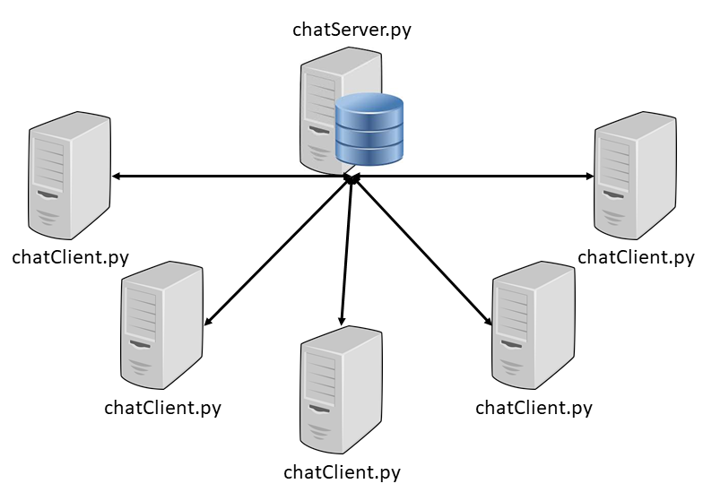

# ASSIGNMENT
### Git
You are **required** to use Github to complete this project
- [Git Workflow](docs/GIT_INFO.md)
- [Git Cheat Sheet](https://services.github.com/on-demand/downloads/github-git-cheat-sheet.pdf)

### Slack
You are **strongly encouraged** to use [Slack](https://principia-csci.slack.com/) to communicate with your group members to complete this project
- Use slack to arrange meeting times
- Use slack to share files quickly with teammates
- use slack to assign to-do lists

### Markdown
- you are to produce a detailed README.md file in your repository
  - [Learn Markdown](https://www.markdownguide.org/)
  - [Markdown Cheat Sheet](https://guides.github.com/pdfs/markdown-cheatsheet-online.pdf)

# Project Description
You are developing a Client/Server based chat application. The server program will reside on an ubuntu server that is accessible to your group through ssh: [your group server info](docs/UbuntuServer.md).

You must first start your chat server on cs-vus-00. Once the chat server is up and running you can start chat clients on other computers connected to the same network. The chat client will contact the chat server for authentication. **NO passwords** are to be sent **without** utilizing some **encryption** technique. If a client fails to authenticate 4 times, they will be locked out 5 minutes.

Once the client has been authenticated by the server, the server broadcasts a message to all other connected clients that the new user is online. The server must also send a message to the new user indicating all other users that are currently online.

Online users have the option of sending a broadcast message to all other online users or sending private messages directly to another user. If a user sends a message to a user that has signed off, the message is stored and delivered once that user signs back on. This message storage only applies to private messages.

When a user signs off, the server sends an update to all online users that the departing user is no longer online.



## Server
* ##### Requirements
  - [ ] maintain a list of usernames and passwords
    - [ ] usernames and passwords read in from csv file when starting up
    - [ ] passwords must be encrypted prior to transmission or saving
    - [ ] new users can be added using a supporting program to encrypt passwords if desired
  - [ ] authenticate users through client requests
    - [ ] 4 failed authentications locks a user out for 5 minutes
  - [ ] Once a user has been authenticated the server does the following
    - [ ] sends a list of online users to the newly authenticated users
    - [ ] sends a broadcast message to all others that the user is now online
  - [ ] relays all broadcast messages to all other online users
  - [ ] delivers private messages directly to specified user
    - [ ] private messages for offline users are stored and delivered when that user comes back online
  - [ ] control + c should terminate your server program without errors

* ##### Running your server program  
  * Server program must be run on the provided ubuntu server
  * **Use Port: 5002**
  * Use terminal or [Bitvise](https://www.bitvise.com/ssh-client-download) *(windows)* to logon to the ubuntu server
  * Clone your repository on [cs-vus-00](docs/UbuntuServer.md)
  ```terminal
    $ git clone https://github.com/PrincipiaCollege/2-pythonChat.git
    $ ./server.py or python3 server.py
  ```
  ```terminal
    use control + c to terminate your server program
  ```

## Client
* ##### Requirements
  - [ ] provide interface to get username and password from users
    - [ ] authenticate with the server
    - [ ] repeat if needed and provide feedback to user
  - [ ] display list of other online users when provided by server
  - [ ] display any server provided messages
  - [ ] provide method for sending broadcast messages
  - [ ] provide method for sending private messages
  - [ ] provide method for going offline and reporting this to the server
